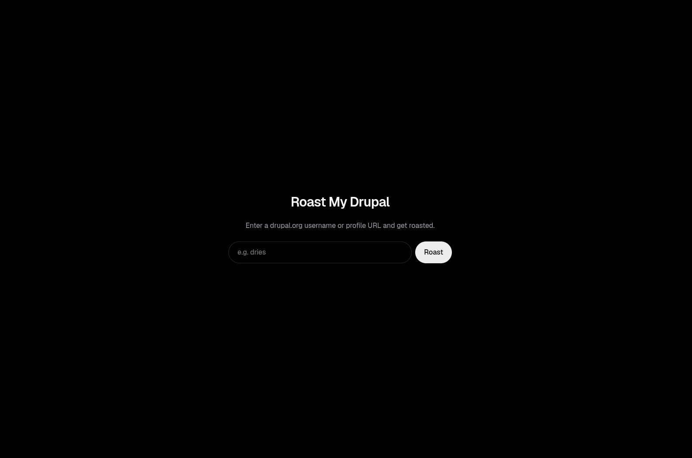

# Roast My Drupal


Submit a drupal.org username or profile URL and get roasted by an LLM based
strictly on your public Drupal activity — bio, badges, projects, and
contribution stats. No personal details (real name, country, employer) are
ever used as roast material.

A single Next.js app: one API route does the scrape → parse → prompt →
stream pipeline server-side, deployed on Vercel.



## How it works

```
[Browser: username/URL input]
        │
        ▼
[app/api/roast/route.ts]
   1. Normalize input → username
   2. Resolve username → uid
   3. Scrape profile + contribution records from drupal.org
   4. Parse into a typed "roast input" (Drupal activity only)
   5. Stream a roast from Gemini
        │
        ▼
[Streamed response back to browser]
```

## Getting started

Requires [pnpm](https://pnpm.io) (`pnpm@10.33.0`).

```bash
pnpm install
cp .env.example .env.local   # add your GOOGLE_GENERATIVE_AI_API_KEY
pnpm dev
```

Open [http://localhost:3000](http://localhost:3000).

## Commands

| Command      | Description                          |
| ------------ | ------------------------------------- |
| `pnpm dev`   | Start the dev server                  |
| `pnpm build` | Production build                      |
| `pnpm start` | Run the production build              |
| `pnpm lint`  | ESLint                                |
| `pnpm test`  | Run the Vitest suite                  |

## Project structure

- `lib/drupal-client.ts` — resolves a username to a uid and scrapes the profile + contribution-record pages
- `lib/parse-profile.ts` — parses the raw HTML into typed fields
- `lib/build-roast-prompt.ts` — narrows parsed data to Drupal-activity-only fields and builds the LLM prompt
- `lib/normalize-username.ts` — accepts a bare username or a full profile URL
- `lib/rate-limiter.ts` — per-IP rate limiting for the API route
- `app/api/roast/route.ts` — the API route: normalize → scrape → build prompt → stream response

See `docs/plans/v1.md` for the full design rationale and `docs/plans/v1-phases.md` for build history.

## Tech

Next.js (App Router) · TypeScript · Cheerio · Vercel AI SDK (`@ai-sdk/google`, Gemini) · Vitest
