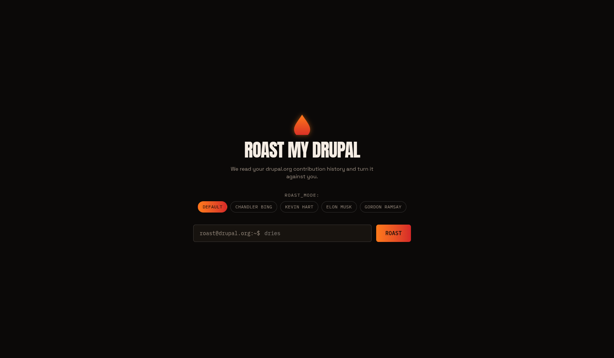

# Roast My Drupal


Submit a drupal.org username or profile URL and get roasted by an LLM based
strictly on your public Drupal activity — bio, badges, projects (with
per-project release/issue health), and contribution stats. No personal
details (real name, country, employer) are ever used as roast material.
Pick a delivery style (Default, Chandler Bing, Kevin Hart, Elon Musk,
Gordon Ramsay) as a comedic-impression layer over the same Drupal-activity
material.

A single Next.js app: one API route does the scrape → parse → prompt →
stream pipeline server-side, deployed on Vercel.



## How it works

```
[Browser: username/URL input + roast mode]
        │
        ▼
[app/api/roast/route.ts]
   1. Normalize input → username
   2. Check KV cache for a recent scrape of this username; on a hit,
      skip straight to step 4
   3. Resolve username → uid, then scrape the profile + both
      contribution-records views, then up to 5 maintained-project
      pages (for release/issue health) — cache the result
   4. Narrow into a typed "roast input" (Drupal activity only)
   5. Build a prompt, layering the selected persona's comedic style
      over the same Drupal-activity material
   6. Stream a roast from Gemini, with stats packed into an
      X-Roast-Stats response header for the frontend's stats card
        │
        ▼
[Streamed response + stats header back to browser]
```

## Getting started

Requires [pnpm](https://pnpm.io) (`pnpm@10.33.0`).

```bash
pnpm install
cp .env.example .env.local   # add your GOOGLE_GENERATIVE_AI_API_KEY
pnpm dev
```

Open [http://localhost:3000](http://localhost:3000).

## Commands

| Command      | Description                          |
| ------------ | ------------------------------------- |
| `pnpm dev`   | Start the dev server                  |
| `pnpm build` | Production build                      |
| `pnpm start` | Run the production build              |
| `pnpm lint`  | ESLint                                |
| `pnpm test`  | Run the Vitest suite                  |

## Project structure

`lib/` is organized by domain:

- `lib/drupal/drupal-client.ts` — resolves a username to a uid, checks the KV cache, and scrapes the profile, both contribution-records views, and up to 5 maintained-project pages
- `lib/drupal/parse-profile.ts` — parses the profile + contribution-records HTML into typed fields
- `lib/drupal/parse-module-health.ts` — parses a maintained project's page for its last release date and open issue count
- `lib/drupal/cache.ts` — KV-backed cache for raw scrape results, keyed by normalized username
- `lib/drupal/normalize-username.ts` — accepts a bare username or a full profile URL
- `lib/roast/build-roast-prompt.ts` — narrows parsed data to Drupal-activity-only fields (`RoastInput`) and builds the LLM system/prompt pair
- `lib/roast/roast-modes.ts` — the five roast personas (Default, Chandler Bing, Kevin Hart, Elon Musk, Gordon Ramsay) layered over the base prompt
- `lib/roast/roast-stats.ts` — encodes/decodes the `X-Roast-Stats` response header used to render the frontend's stats card
- `lib/roast/stream-error.ts` — turns AI SDK stream errors (e.g. Gemini quota errors) into user-facing messages
- `lib/rate-limiter.ts` — per-IP rate limiting for the API route
- `app/api/roast/route.ts` — the API route: normalize → scrape (cache-checked) → build prompt → stream response
- `app/components/` — `ModePicker`, `StatsCard`, `PipelineLog`, `FlameDrop` frontend components

See `docs/plans/v1.md` for the full design rationale and `docs/plans/v1-phases.md` for build history.

## Tech

Next.js (App Router) · TypeScript · Cheerio · Vercel AI SDK (`@ai-sdk/google`, Gemini) · Vercel KV · Vitest
